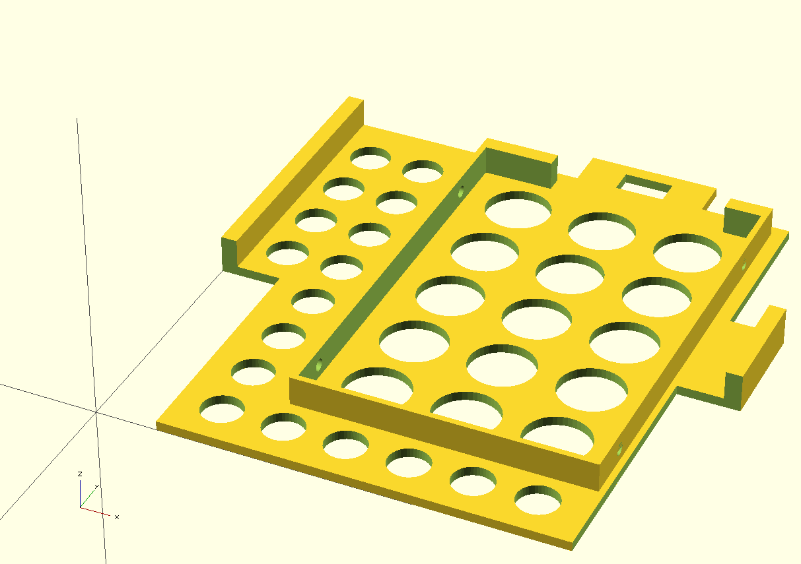

# SSD Caddy for ODD bay of HP Microserver Gen8

The caddy is designed to fit the optical drive bay of a HP Proliant Microserver
Gen8 and will latch into the locking mechanism. It is short enough for the
original slot cover to fit. The tray accomodates a 2.5" SSD (or HDD).

